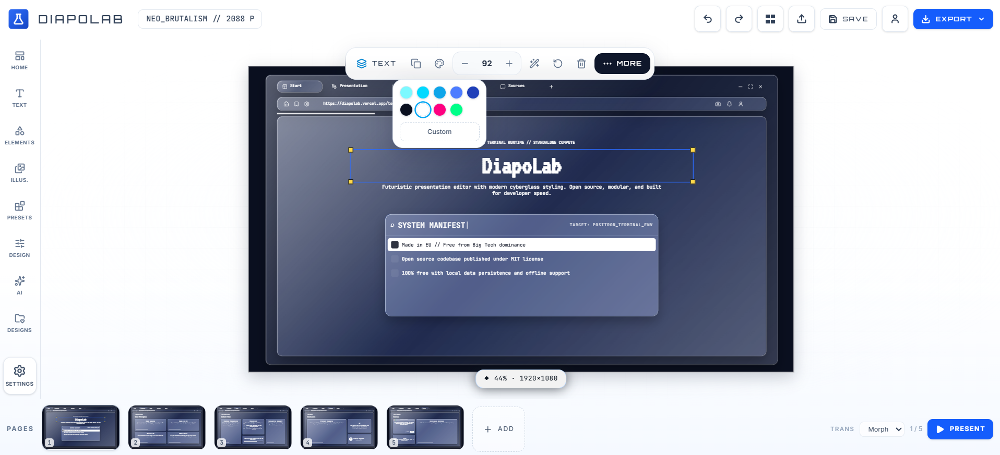

#  DiapoLab

> Build modern decks, faster. Open-source presentation editing with templates, AI assistance, cloud saves, and polished export workflows.

A modern, open-source presentation editor for creating beautiful slides with speed, flexibility, and creative control.

<div align="center">


✨ A creative slide editor with templates, AI-assisted slide ideas, theme controls, secure cloud saves, and export options for real-world presentations.

</div>

## 📸 Screenshot

<p align="center">
  
</p>

> Replace `./public/screenshot.png` with your preferred screenshot filename when ready.

## 🌍 Overview

DiapoLab is a browser-based presentation workspace built with React, Vite, TypeScript, and Supabase. It is designed for users who want a flexible editor that feels fast and expressive while remaining approachable for everyday creative work.

The app includes:

- 🖼️ a multi-slide editor canvas
- 📝 rich text and layout controls
- 🧩 reusable design components and templates
- 🤖 AI-assisted slide analysis and improvement suggestions
- 🎨 theme customization and presentation mode
- 📦 import/export for sharing and downstream workflows
- 🔐 authenticated cloud saves and publishing


## ⚡ Features

### 🖊️ Editor Features

- Multi-slide deck editing
- Canvas-based positioning and manipulation for elements
- Text tools for creating and styling slide content
- Shape and illustration support
- Preset components and reusable blocks
- Slides thumbnail and page navigation
- Presentation mode for full-screen playback
- Undo/redo and quick design cleanup tools

### 🎨 Design & Styling

- Custom themes and editor styling controls
- Background and layout adjustments
- Template-driven starter experiences
- Presets in different styles
- Flexible visual identity for presentation output

### 🤖 AI Assistance

- AI slide analysis for current slide content
- Suggestions for hierarchy and visual improvement
- Help generating or refining slide ideas
- Personalized editing assistance inside the editor

### ☁️ Cloud & Collaboration

- Sign-in flow with Supabase auth
- Save designs to user account
- Load and manage personal projects
- Public share links for published decks
- Marketplace and template publishing workflow

### 📤 Import / Export

- Import existing design JSON
- Export decks as:
  - PNG
  - PDF
  - PPTX
  - HTML
  - JSON
  - GIF

### 🧭 App Experience

- Responsive modern UI
- Settings and preferences screen
- About, privacy policy, and license pages
- Open-source MIT license

## 🛠️ Tech Stack

- React 19
- TypeScript
- Vite
- TanStack Router
- Tailwind CSS
- Zustand for app state
- Supabase for auth and data persistence
- Radix UI primitives
- Lucide icons

## 📁 Project Structure

```text
.
├── public/
├── src/
│   ├── components/
│   │   ├── editor/
│   │   └── ui/
│   ├── hooks/
│   ├── integrations/
│   ├── lib/
│   ├── routes/
│   ├── store/
│   ├── types/
│   ├── router.tsx
│   ├── server.ts
│   ├── start.ts
│   ├── styles.css
│   └── routeTree.gen.ts
├── .env
├── .gitignore
├── components.json
├── eslint.config.js
├── LICENSE
├── package.json
├��─ tsconfig.json
├── vite.config.ts
├── wrangler.jsonc
├── README.md
└── bun.lock
```

## ✅ Requirements

Before starting the app, make sure you have:

- Node.js 18+
- npm 9+

## 🚀 Quick Start

### 1. Clone the repository

```bash
git clone https://github.com/PNBPositron/DiapoLab.git
cd DiapoLab
```

### 2. Install dependencies

```bash
npm install
```

### 3. Configure environment variables

Create a `.env` file in the project root with your Supabase configuration. The app expects values similar to:

```env
SUPABASE_URL="https://your-project.supabase.co"
SUPABASE_PUBLISHABLE_KEY="your-publishable-key"
VITE_SUPABASE_URL="https://your-project.supabase.co"
VITE_SUPABASE_PUBLISHABLE_KEY="your-publishable-key"
```

You may also need project-specific environment values depending on your local setup.

### 4. Start the development server

```bash
npm run dev
```

Then open the local URL shown in the terminal.

## 📦 Production Build

```bash
npm run build
```

Preview the production build locally:

```bash
npm run preview
```

## 🧪 Available Scripts

```bash
npm run dev      # start the development app
npm run build    # create a production build
npm run preview  # preview the built app locally
npm run lint     # run ESLint
npm run format   # format source files with Prettier
```

## 🧠 Development Notes

This project is structured around a centralized editor store and route-based application shell. The core editor logic lives under `src/components/editor` and `src/store`, while route pages and supporting application scaffolding are organized around the Vite + React app structure.

## 🤝 Contributing

Contributions are welcome.

If you want to contribute:

1. Fork the repository
2. Create a feature branch
3. Commit your changes
4. Open a pull request with a clear description

## 📜 License

This project is licensed under the MIT License. See the [LICENSE](LICENSE) file for details.

## 📌 Project Status

DiapoLab is actively evolving as a presentation editor with template publishing, AI support, and export workflows. It is suitable for experimentation, local development, and open-source extension.

## 🔗 Links

- Repository: https://github.com/PNBPositron/DiapoLab
- License: MIT
- App concept: Presentation editor / slide design tool
